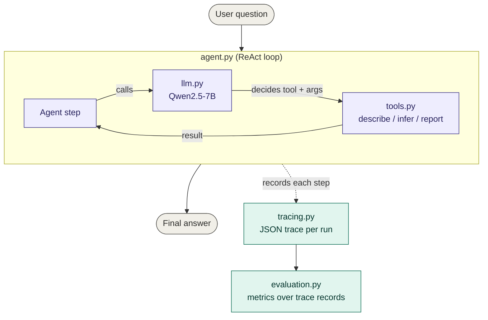

# msc-cx-agent-bench
UCL MSc Project - Benchmarking Agentic Systems for Customer Feedback Analytics 

## Proof of concept

What I've built:
- A minimal end-to-end CX analytics agent
- Dataset: FABSA (10500+ reviews, 12 aspect categories, 3 sentiment classes, 10 industries).
- LLM: Ollama qwen2.5:7b-instruct
- Architecture: ReAct from scratch
- The agent answers 3 types of questions (descriptive, inferential and reporting) by routing them through a small set of tools.

## Architecture



## Benchmark metrics 

1. skill_correct: Did the agent pick the right tool?
2. path_efficient: Did it take the minimum number of steps?
3. num_loop_detected: Did the agent re-call a tool with identical arguments?
4. answer_has_markup: Did the final answer have JSON/markup characters?
5. latency_seconds: End-to-end response time

## Setup

```bash
conda env create -f environment.yml
conda activate cx-agent
pip install -e .

# Pull the model (requires Ollama running)
ollama pull qwen2.5:7b-instruct
```

## Usage

```bash
# Ask a single question
cx-agent ask "What are the top complaints in Trading?"

# Run the benchmark
cx-agent benchmark
```

## Repo structure

```
src/cx_agent/
├── data.py         # Load FABSA dataset
├── tools.py        # 3 analytics tools
├── llm.py          # LLM client and tool schemas
├── agent.py        # ReAct loop with loop detection
├── tracing.py      # Record the trace of each agent run
├── evaluation.py   # Run metrics and benchmark
└── cli.py          # Command-line interface

notebooks/          # EDA and development notebooks
traces/             # Saved trace JSONs (gitignored)
known_limitations.md  # Documented failure modes
```